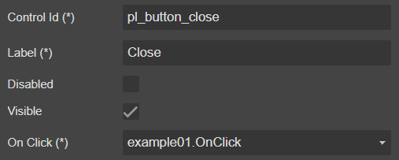

# Button

Render a button

## Draggable To

- [Footer](../../Footer)
- [TabFooter](../../TabFooter)

## Properties



|Name|Required|Description|A picture is worth a thousand words
|-|-|-|-|
|Control Id|x|The [Control Id](../../../others/ControlId)
|Label|x||
|Disabled|||
|Visible|||
|On Click|x|Fire [Event](../../MetaData/Event) when user click on the button

## FormXml

```xml
<cell id="{a523b067-3c98-4d70-b826-9c542f7d4b5c}" visible="true">
    <labels>
        <label description="Close" languagecode="1033" />
    </labels>
    <control uniqueid="{88e43bc3-386e-410d-98bb-07c9828325d3}" id="pl_button_close" classid="{00AD73DA-BD4D-49C6-88A8-2F4F4CAD4A20}" disabled="false" isunbound="true" />
</cell>
```
