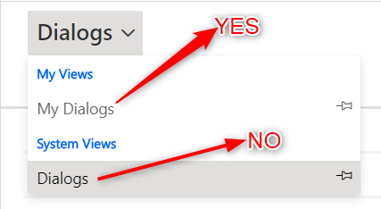
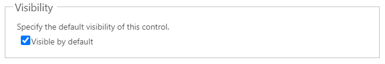

# Chart


## Draggable

- [Section](../../Section)

## Properties


|Name|Required|Description|A picture is worth a thousand words
|-|-|-|-|
|Control Id|**x**|The [control id](../../../others/ControlId)
|Entity Logical Name|**x**|The [entity logical name](../../../others/ControlId)
|ViewId|**x**|**```GUID```**|
|User View?|||
|ViewIds||List **```ViewId```** seperator by **```,```**
|Visualization Id|**x**|**```GUID```**|
|User Chart?|||
|Enable Chart Picker||Allow user change to another chart or not
|Rows|**x**|The number of rows for chart render
|Visible|||
|PCF|

## FormXml

```xml
<row>
    <cell id="{8C14B551-F106-486C-AB9A-C7870254CA21}" visible="true" rowspan="10">
        <labels>
            <label description="" languagecode="1033" />
        </labels>
        <control uniqueid="{8C14B551-F106-486C-AB9A-C7870254CA22}" id="pl_chart" classid="{E7A81278-8635-4D9E-8D4D-59480B391C5B}" isunbound="true">
            <parameters>
                <AutoExpand>Fixed</AutoExpand>
                <ChartGridMode>Chart</ChartGridMode>
                <TargetEntityType>pl_dialog</TargetEntityType>
                <ViewId>{255E2268-E36D-48BC-836E-A8BC855D6D7C}</ViewId>
                <ViewIds>{255E2268-E36D-48BC-836E-A8BC855D6D7C}</ViewIds>
                <IsUserView>false</IsUserView>
                <VisualizationId>{8E53F9D6-7C69-EA11-A812-000D3AA081A9}</VisualizationId>
                <IsUserChart>false</IsUserChart>
                <EnableChartPicker>true</EnableChartPicker>
            </parameters>
        </control>
    </cell>
</row>
```
