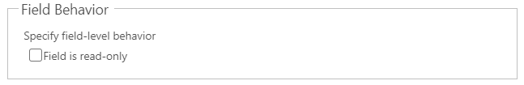

# DateTime

##### 1. DateAndTime


##### 2. Date


## Draggable

- [Section](../../Section)

## Properties


|Name|Required|Description|A picture is worth a thousand words
|-|-|-|-|
|Control Id|**x**|The [control id](../../../others/ControlId)
|Label||The display label|
|Type|**x**|<ul><li>**```DateAndTime```**</li><li>**```Date```**</li></ul>|
|Disabled|||
|Visible|||
|On Change||Fire [event](../../MetaData/Event) when user change the value
|PCF||Bind this control to [PCF](../../MetaData/PCF) control

## FormXml

```xml
<row>
    <cell id="{d474008e-eb1a-484a-99c4-43b16a01fb42}" visible="true">
        <labels>
            <label description="Date Only" languagecode="1033" />
        </labels>
        <control uniqueid="{e92814dd-8a88-4c9f-b3a7-477d527b1d7c}" id="pl_datecontrol" classid="{5B773807-9FB2-42DB-97C3-7A91EFF8ADFF}" isrequired="true" disabled="false" isunbound="true">
            <parameters>
                <Format>DateAndTime</Format>
            </parameters>
        </control>
    </cell>
</row>
```
