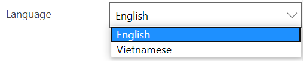
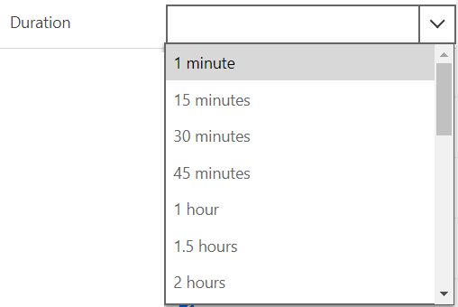
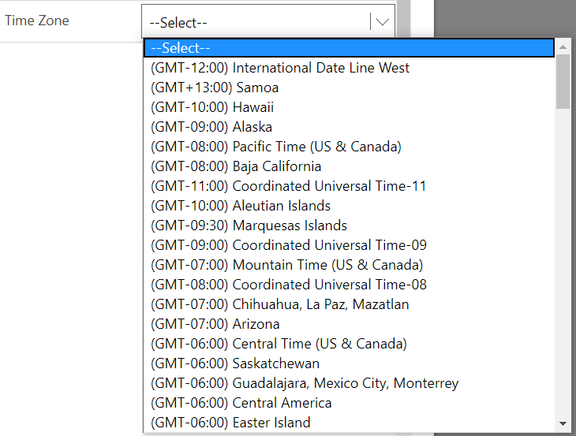
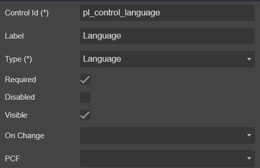

# DropDown

##### 1. Language



##### 2. Duration



##### 3. Time Zone




## Draggable

- [Section](../../Section)

## Properties



|Name|Required|Description|A picture is worth a thousand words
|-|-|-|-|
|Control Id|**x**|The [control id](../../../others/ControlId)
|Label||The display label|
|Type|**x**|<ul><li>**```Language```**</li><li>**```Duration```**</li><li>**```Time Zone```**</li></ul>|
|Required|||
|Disabled|||
|Visible|||
|On Change||Fire [event](../../MetaData/Event) when user change the value
|PCF||Bind this control to [PCF](../../MetaData/PCF) control

## FormXml

```xml
<row>
    <cell id="{bf396dbf-afdc-4851-80e2-79af523a5d78}" visible="true">
        <labels>
            <label description="Language" languagecode="1033" />
        </labels>
        <control uniqueid="{f362718a-60b7-4f4f-94e4-dcdccfc560a4}" id="pl_control_language" classid="{671A9387-CA5A-4D1E-8AB7-06E39DDCF6B5}" isrequired="true" disabled="false" isunbound="true" />
    </cell>
</row>
```
