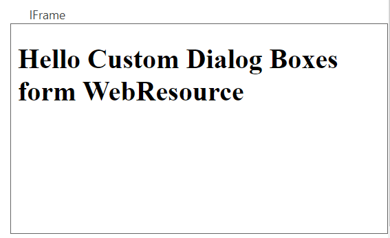

# Iframe



## Draggable

- [Section](../../Section)

## Properties


|Name|Required|Description|A picture is worth a thousand words
|-|-|-|-|
|Control Id|**x**|The [control id](../../../others/ControlId)
|Label||The display label
|Rows|**x**|The number of rows for iframe render
|URL|||
|Pass Parameters|||
|Security|||
|Scrolling|||
|Border|||
|Border|||
|Show On Mobile Client|||
|PCF||Bind this control to [PCF](../../MetaData/PCF) control

## FormXml

```xml
<row>
    <cell id="{63d34b77-17bb-49a5-a8e4-7c6d6ac7a41b}" visible="true" rowspan="3">
        <labels>
            <label description="GOOGLE" languagecode="1033" />
        </labels>
        <control uniqueid="{455373d6-5a23-494e-a328-cfe9568da68b}" id="pl_control_iframe" classid="{FD2A7985-3187-444E-908D-6624B21F69C0}" isunbound="true">
            <parameters>
                <Url>https://www.google.com</Url>
                <PassParameters>true</PassParameters>
                <Security>true</Security>
                <Scrolling>true</Scrolling>
                <Border>false</Border>
                <ShowOnMobileClient>false</ShowOnMobileClient>
            </parameters>
        </control>
    </cell>
</row>
```
