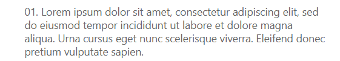
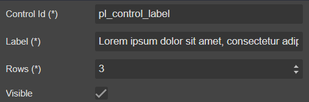

# Label



## Draggable

- [Header](../../Header)
- [TabHeader](../../TabHeader)
- [Section](../../Section)

## Properties



|Name|Required|Description|A picture is worth a thousand words
|-|-|-|-|
|Control Id|**x**|The [control id](../../../others/ControlId)
|Label|**x**|The display label
|Rows|**x**|The number of rows for label render
|Visible|||

## FormXml

```xml
<row>
    <cell id="{c9c1b7b3-088c-408b-9dd0-7cb7c4b62b3e}" visible="true" rowspan="3">
        <labels>
            <label description="Lorem ipsum dolor sit amet, consectetur adipiscing elit, sed do eiusmod tempor incididunt ut labore et dolore magna aliqua. Feugiat vivamus at augue eget arcu dictum varius. Mattis ullamcorper velit sed ullamcorper morbi tincidunt ornare massa." languagecode="1033" />
        </labels>
        <control uniqueid="{7807ecdd-3948-4ac2-8fb1-80987161d749}" id="pl_control_label" classid="{39354E4A-5015-4D74-8031-EA9EB73A1322}" isunbound="true">
            <parameters>
                <IsTitle>false</IsTitle>
            </parameters>
        </control>
    </cell>
</row>
```
