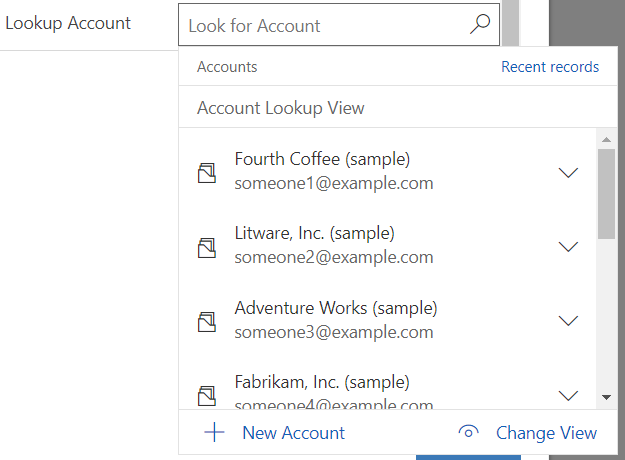
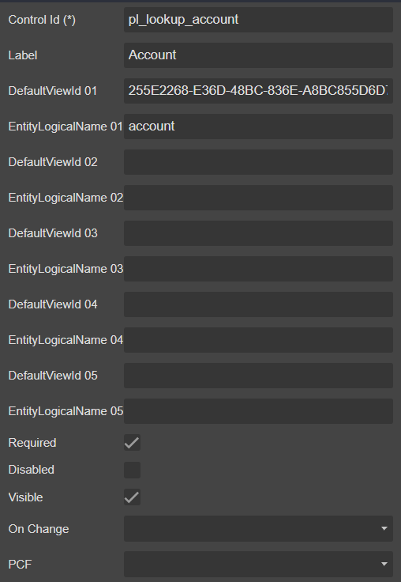

# Lookup



## Draggable

- [Section](../../Section)

## Properties



|Name|Required|Description|A picture is worth a thousand words
|-|-|-|-|
|Control Id|**x**|The [control id](../../../others/ControlId)
|Label||The display label
|DefaultViewId 01||**```GUID```**|
|Entity Logical Name 01||The [entity logical name](../../../others/ControlId)
|...
|DefaultViewId 05
|Entity Logical Name 05
|Required|||
|Disabled|||
|Visible|||
|On Change||Fire [event](../../MetaData/Event) when user change the value
|PCF||Bind this control to [PCF](../../MetaData/PCF) control

## FormXml

```xml
<row>
    <cell id="{c0dd5d64-128f-4c99-8c2b-8b767ab76d05}" visible="true">
        <labels>
            <label description="Account" languagecode="1033" />
        </labels>
        <control uniqueid="{d6baeb02-5079-47f8-a03b-020f4da9674e}" id="pl_lookup_account" classid="{270BD3DB-D9AF-4782-9025-509E298DEC0A}" isrequired="true" disabled="false" isunbound="true">
            <parameters>
                <TargetEntities>
                    <TargetEntity>
                        <DefaultViewId>{255E2268-E36D-48BC-836E-A8BC855D6D7C}</DefaultViewId>
                        <EntityLogicalName>account</EntityLogicalName>
                    </TargetEntity>
                </TargetEntities>
            </parameters>
        </control>
    </cell>
</row>
```
