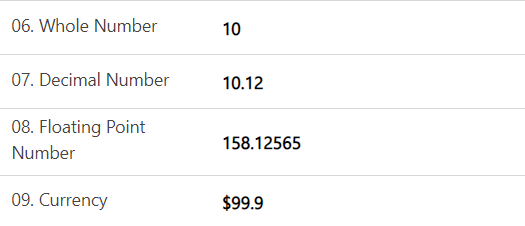
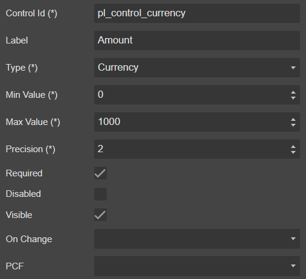
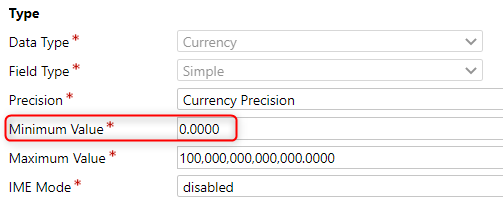
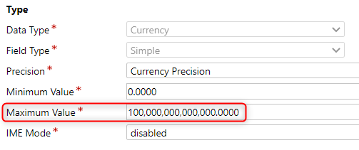
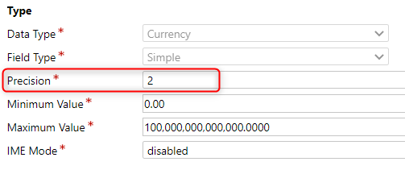

# Number



## Draggable

- [Section](../../Section)

## Properties



|Name|Required|Description|A picture is worth a thousand words
|-|-|-|-|
|Control Id|**x**|The [control id](../../../others/ControlId)
|Label||The display label
|Type|**x**|<ul><li>**```Whole Number```**</li><li>**```Decimal Number```**</li><li>**```Floating Point Number```**</li><li>**```Currency```**</li></ul>
|Min Value|**x**||
|Max Value|**x**||
|Precision|**x**||
|Required|||
|Disabled|||
|Visible|||
|On Change||Fire [event](../../MetaData/Event) when user change the value
|PCF||Bind this control to [PCF](../../MetaData/PCF) control

## FormXml

```xml
<row>
    <cell id="{aab3dbb4-881c-4626-965f-f5936c5d81dc}" visible="true">
        <labels>
            <label description="Amount" languagecode="1033" />
        </labels>
        <control uniqueid="{64917424-45a0-4480-8028-e152c42560f6}" id="pl_control_currency" classid="{533B9E00-756B-4312-95A0-DC888637AC78}" isrequired="true" disabled="false" isunbound="true">
            <parameters>
                <MinValue>0</MinValue>
                <MaxValue>1000</MaxValue>
                <Precision>2</Precision>
            </parameters>
        </control>
    </cell>
</row>
```
