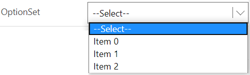
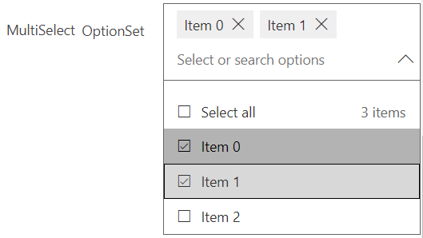
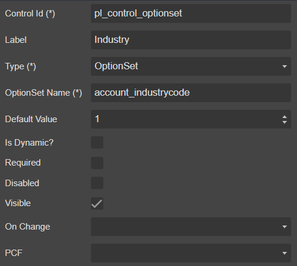
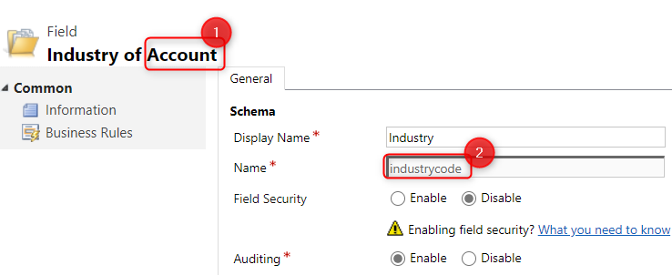

# OptionSet

##### 1. OptionSet



##### 2. MultiSelect OptionSet



## Draggable

- [Section](../../Section)

## Properties



|Name|Required|Description|A picture is worth a thousand words
|-|-|-|-|
|Control Id|**x**|The [control id](../../../others/ControlId)
|Label||The display label
|Type|**x**|<ul><li>**```OptionSet```**</li><li>**```MultiSelect OptionSet```**</li></ul>
|OptionSet Name|**x**|<ul><li>**```entity-logical-name```**_**```optionset-logical-name```** (Local OptionSet)</li><li>**```optionset-logical-name```** (Global OptionSet)</li></ul>|
|Default Value||**```OnLoad```** select this value as the default
|Is Dynamics?||Use for dynamic **```addOption```** **```OnLoad```** event
|Required|||
|Disabled|||
|Visible|||
|On Change||Fire [event](../../MetaData/Event) when user change the value
|PCF||Bind this control to [PCF](../../MetaData/PCF) control

## FormXml

```xml
<row>
    <cell id="{8e0f4e6f-a794-4a5d-bd25-baec596d4e27}" visible="true">
        <labels>
            <label description="Industry" languagecode="1033" />
        </labels>
        <control uniqueid="{b6e17789-2092-4d60-96c6-31f663ef74a4}" id="pl_control_optionset" classid="{4AA28AB7-9C13-4F57-A73D-AD894D048B5F}" isrequired="false" disabled="false" isunbound="true">
            <parameters>
                <OptionSetName>account_industrycode</OptionSetName>
                <DefaultValue>1</DefaultValue>
            </parameters>
        </control>
    </cell>
</row>
```
