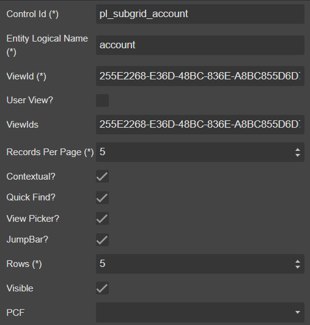

# Subgrid


## Draggable

- [Section](../../Section)

## Properties



|Name|Required|Description|A picture is worth a thousand words
|-|-|-|-|
|Control Id|**x**|The [control id](../../../others/ControlId)
|Entity Logical Name|**x**|The [entity logical name](../../../others/ControlId)
|ViewId|**x**|**```GUID```**|
|User View?|||
|ViewIds||List **```ViewId```** seperator by **```,```**
|Records Per Page|||
|Contextual?|||
|Quick Find?|||
|View Picker?|||
|JumpBar?|||
|Rows|**x**|The number of rows for subgrid render
|Visible|||
|PCF|

## FormXml

```xml
<row>
    <cell id="{eb29bfb1-a8bd-44b3-9ec0-dab6b6e7496a}" visible="true" rowspan="5">
        <labels>
            <label description="" languagecode="1033" />
        </labels>
        <control uniqueid="{a227c954-3dae-41b4-96fa-7b81c41ca3f1}" id="pl_subgrid_account" classid="{E7A81278-8635-4D9E-8D4D-59480B391C5B}" isunbound="true">
            <parameters>
                <AutoExpand>Fixed</AutoExpand>
                <ChartGridMode>Grid</ChartGridMode>
                <TargetEntityType>account</TargetEntityType>
                <ViewId>{255E2268-E36D-48BC-836E-A8BC855D6D7C}</ViewId>
                <ViewIds>{255E2268-E36D-48BC-836E-A8BC855D6D7C}</ViewIds>
                <IsUserView>false</IsUserView>
                <RecordsPerPage>5</RecordsPerPage>
                <EnableContextualActions>true</EnableContextualActions>
                <EnableQuickFind>true</EnableQuickFind>
                <EnableViewPicker>true</EnableViewPicker>
                <EnableJumpBar>true</EnableJumpBar>
            </parameters>
        </control>
    </cell>
</row>
```
