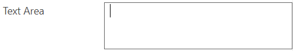
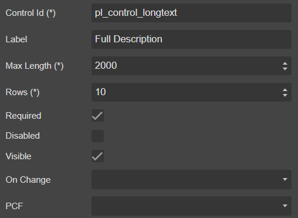

# TextArea



## Draggable

- [Section](../../Section)

## Properties



|Name|Required|Description|A picture is worth a thousand words
|-|-|-|-|
|Control Id|**x**|The [control id](../../../others/ControlId)
|Label||The display label
|Max Length|**x**
|Rows|**x**|The number of rows for textarea render
|Required|||
|Disabled|||
|Visible|||
|On Change||Fire [event](../../MetaData/Event) when user change the value
|PCF||Bind this control to [PCF](../../MetaData/PCF) control

## FormXml

```xml
<row>
    <cell id="{c7d74443-a173-464d-aebe-3423deb77d31}" visible="true" rowspan="10">
        <labels>
            <label description="Full Description" languagecode="1033" />
        </labels>
        <control uniqueid="{854e17f5-716a-489f-8aa4-912bd2ff7e0c}" id="pl_control_longtext" classid="{E0DECE4B-6FC8-4A8F-A065-082708572369}" isrequired="true" disabled="false" isunbound="true">
            <parameters>
                <MaxLength>2000</MaxLength>
                <Format>TextArea</Format>
            </parameters>
        </control>
    </cell>
</row>
```
