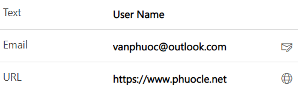
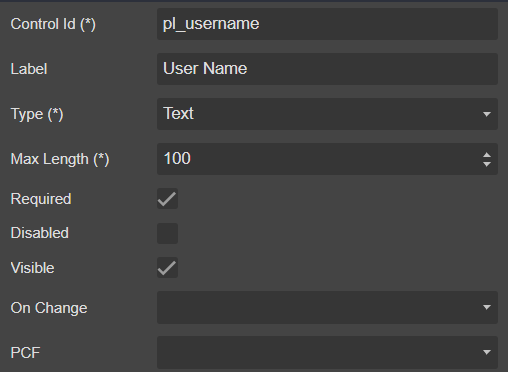

# TextBox



## Draggable

- [Section](../../Section)

## Properties



|Name|Required|Description|A picture is worth a thousand words
|-|-|-|-|
|Control Id|**x**|The [control id](../../../others/ControlId)
|Label||The display label
|Type|**x**|<ul><li>**```Text```**</li><li>**```Email```**</li><li>**```URL```**</li></ul>
|Max Length|**x**
|Required|||
|Disabled|||
|Visible|||
|On Change||Fire [event](../../MetaData/Event) when user change the value
|PCF||Bind this control to [PCF](../../MetaData/PCF) control

## FormXml

```xml
<row>
    <cell id="{932f0e09-8cf2-4aac-9b9c-5490d29bb3f3}" visible="true">
        <labels>
            <label description="User Name" languagecode="1033" />
        </labels>
        <control uniqueid="{f4672970-74b2-4542-b4d4-6074d88142d7}" id="pl_username" classid="{4273EDBD-AC1D-40D3-9FB2-095C621B552D}" isrequired="true" disabled="false" isunbound="true">
            <parameters>
                <MaxLength>100</MaxLength>
                <Format>SingleLineOfText</Format>
            </parameters>
        </control>
    </cell>
</row>
```
