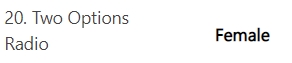
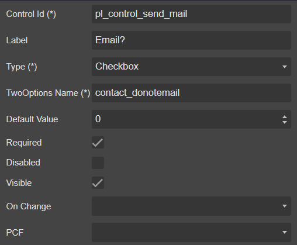

# TwoOptions

##### 1. Checkbox


##### 2. Radio



## Draggable

- [Section](../../Section)

## Properties



|Name|Required|Description|A picture is worth a thousand words
|-|-|-|-|
|Control Id|**x**|The [control id](../../../others/ControlId)
|Label||The display label
|Type|**x**|<ul><li>**```Checkbox```**</li><li>**```Radio```**</li></ul>
|TwoOptions Name|**x**|<ul><li>**```entity-logical-name```**_**```optionset-logical-name```** (Local OptionSet)</li><li>**```optionset-logical-name```** (Global OptionSet)</li></ul>
|Default Value||**```OnLoad```** select this value as the default
|Is Dynamics?||Use for dynamic **```addOption```** **```OnLoad```** event
|Required|||
|Disabled|||
|Visible|||
|On Change||Fire [event](../../MetaData/Event) when user change the value
|PCF||Bind this control to [PCF](../../MetaData/PCF) control

## FormXml

```xml
<row>
    <cell id="{24fa5092-10cc-4673-b153-d451297896b5}" visible="true">
        <labels>
            <label description="Email?" languagecode="1033" />
        </labels>
        <control uniqueid="{11481e44-60d0-410d-af80-ad0b3d2f51e9}" id="pl_control_send_mail" classid="{B0C6723A-8503-4FD7-BB28-C8A06AC933C2}" isrequired="true" disabled="false" isunbound="true">
            <parameters>
                <OptionSetName>contact_donotemail</OptionSetName>
                <DefaultValue>0</DefaultValue>
            </parameters>
        </control>
    </cell>
</row>
```
