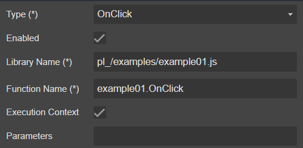
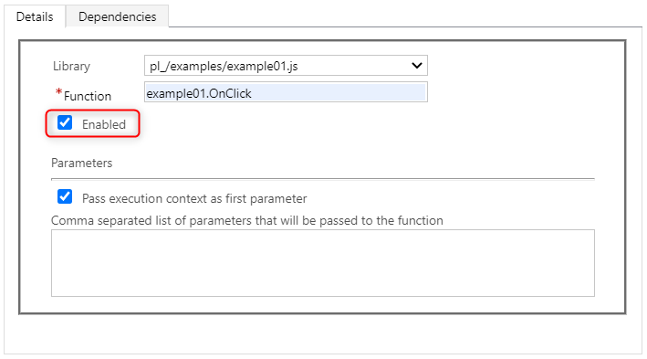
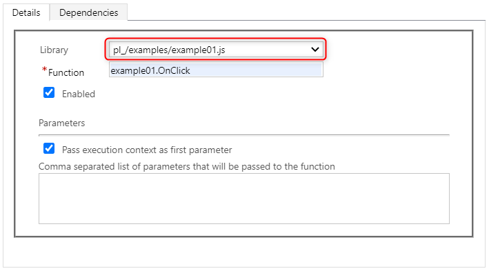
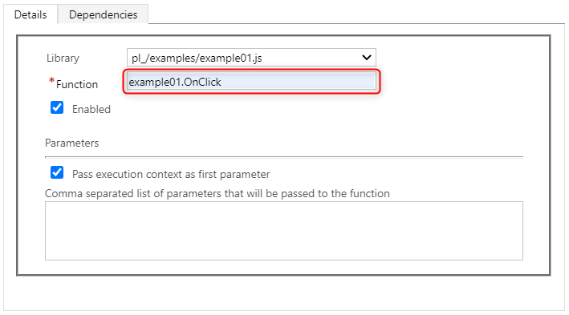
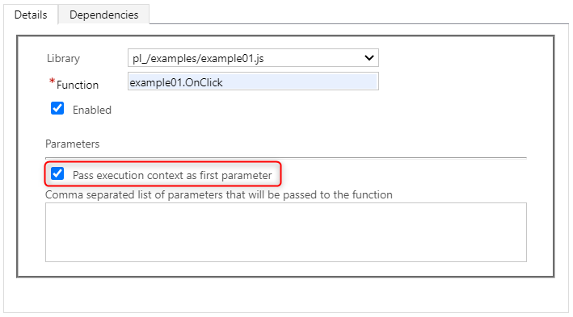
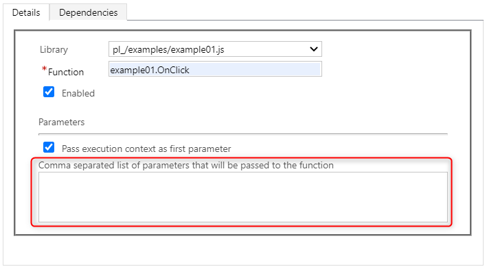

# Event

## Draggable To

- [MetaData](..)

## Properties



|Name|Required|Description|A picture is worth a thousand words
|-|-|-|-|
|Type|**x**|<ul><li>**```OnLoad```**</li><li>**```OnClick```**</li><li>**```OnChange```**</li></ul>
|Enabled|||
|Library Name|**x**||
|Function Name|**x**||
|Execution Context|||
|Parameters|||

## FormXml

```xml
<event name="onclick" application="false" active="false" attribute="pl_button_close">
    <Handlers>
        <Handler functionName="example01.OnClick" libraryName="$webresource:pl_/examples/example01.js" handlerUniqueId="{15cb507c-e1d5-41ae-8cb7-0aff1d34c515}" enabled="true" parameters="" passExecutionContext="true" />
    </Handlers>
</event>
```
