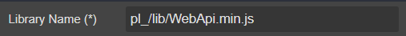
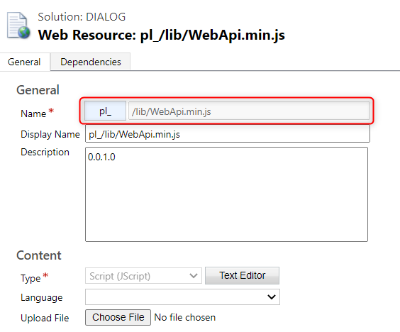

# JavaScript

Reference and JavaScript to form. E.g. WebApi, Lodash, Underscore, ...

## Draggable To

- [MetaData](..)

## Properties



|Name|Required|Description|A picture is worth a thousand words
|-|-|-|-|
|Library Name|x||

## FormXml

```xml
<clientincludes>
    <internaljscriptfile src="$webresource:pl_/lib/WebApi.min.js" />
</clientincludes>
```
