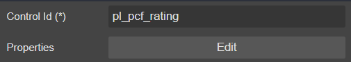
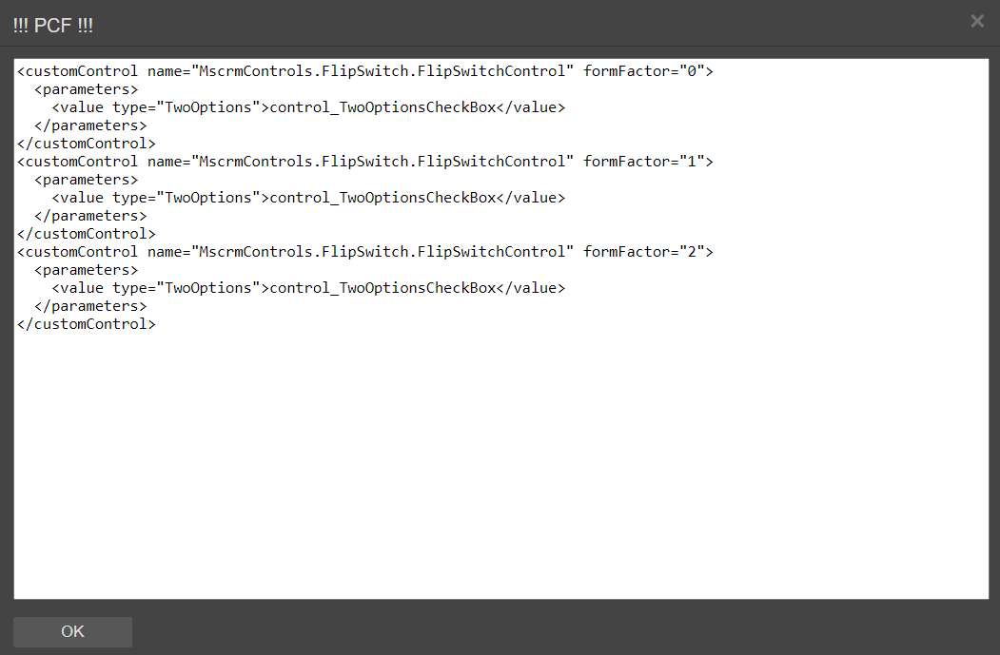

# PCF

You known PCF ? Yes, you can use it in crmdialog

## Draggable To

- [MetaData](..)

## Properties



|Name|Required|Description|A picture is worth a thousand words
|-|-|-|-|
|Control Id|x|The [Control Id](../../../others/ControlId)|

Click ```Edit``` button to manually update the ```xml``` of PCF



>**Note**
If you don't known how to define the ```xml``` of PCF. I recommend you don't use it. Because if you do incorrect, the form load failed in Dynamics CRM/CDS.

## FormXml

```xml
<controlDescription forControl="{f993126a-b03f-4f3a-a136-0d8407e8ec74}">
    <customControl name="MscrmControls.FlipSwitch.FlipSwitchControl" formFactor="0">
        <parameters>
        <value type="TwoOptions">control_TwoOptionsCheckBox</value>
        </parameters>
    </customControl>
    <customControl name="MscrmControls.FlipSwitch.FlipSwitchControl" formFactor="1">
        <parameters>
        <value type="TwoOptions">control_TwoOptionsCheckBox</value>
        </parameters>
    </customControl>
    <customControl name="MscrmControls.FlipSwitch.FlipSwitchControl" formFactor="2">
        <parameters>
        <value type="TwoOptions">control_TwoOptionsCheckBox</value>
        </parameters>
    </customControl>
</controlDescription>
```
