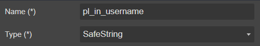

# Parameter

Pass a dynamic parameter value to form

>**Note**
Please don't confuse with **Parameters** of [event](../Event)

## Draggable To

- [MetaData](..)

## Properties



|Name|Required|Description|A picture is worth a thousand words
|-|-|-|-|
|Name|**x**|The [parameter name](../../../others/ControlId)|
|Type|**x**|<ul><li>**```SafeString```**</li><li>**```Boolean```**</li><li>**```UniqueId```**</li><li>**```PositiveInteger```**</li><li>**```DateTime```**</li><li>**```EntityType```**</li><li>**```Object```**</li></ul>|

## FormXml

```xml
<querystringparameter name="pl_in_username" type="SafeString" />
```
