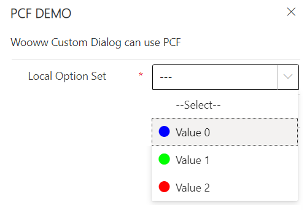

# Colorful OptionSet

## Install solution

- [Colorful Optionset](https://pcf.gallery/colorful-optionset)

## Supported control

- [OptionSet](../../blocks/Controls/OptionSet)

## Preview



## XML

>**NOTED:**
Replace **```[controlname]```** with the **```Control Id```**\
E.g: [controlname] = pl_optionset_assignto

```xml
<customControl formFactor="0" name="orb_ORBIS.ColorfulOptionset">
    <parameters>
        <optionsInput type="OptionSet">[controlname]</optionsInput>
    </parameters>
</customControl>
<customControl formFactor="1" name="orb_ORBIS.ColorfulOptionset">
    <parameters>
        <optionsInput type="OptionSet">[controlname]</optionsInput>
    </parameters>
</customControl>
<customControl formFactor="2" name="orb_ORBIS.ColorfulOptionset">
    <parameters>
        <optionsInput type="OptionSet">[controlname]</optionsInput>
    </parameters>
</customControl>
```
