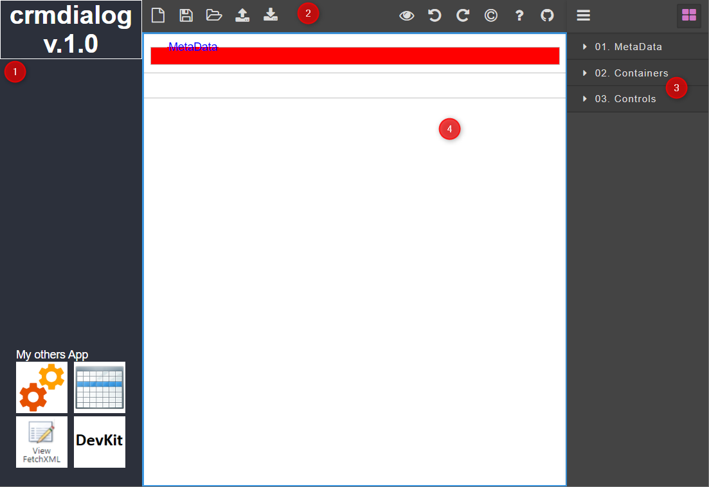

## 1. Properties window

A window properties of the selected control

## 2. Toolbars

- **New**
- **Save** to [local storage](https://en.wikipedia.org/wiki/Local_storage). Each **```10```** steps/actions system trigger **```auto-save```**
- **Open** from [local storage](https://en.wikipedia.org/wiki/Local_storage)
- **[Upload](others/Upload)** an **```existing```** **```Dynamics 365 CRM/CDS solution```** to **```crmdialog```** that you can **```update/edit```** the form dialog
- **[Download](others/Download)** **```Dynamics 365 CRM/CDS solution```** from **```crmdialog```**, then you can **```import```** to **```Dynamics 365 CRM/CDS```**
- **Preview**
- **Undo**
- **Redo**
- **About** [PhuocLe](https://www.phuocle.net)
- **Github**

## 3. Layer and Blocks

- **[Layer](others/Layer)** show your form design as the treeview
- **[Blocks](blocks)** the block you can add to form

## 4. Form Designer

Your form designer here

## Examples

- [Find User Id](../examples/example01)
- [New Assign](../examples/example02)
