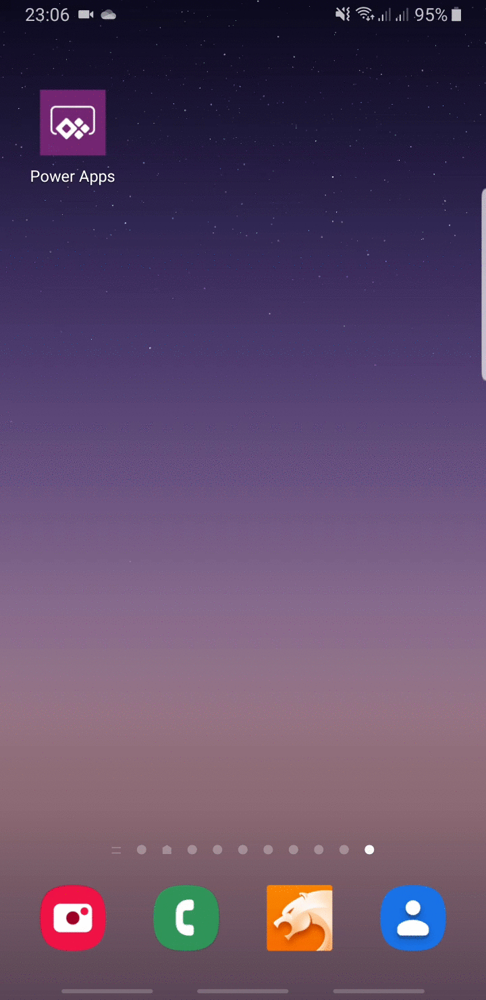
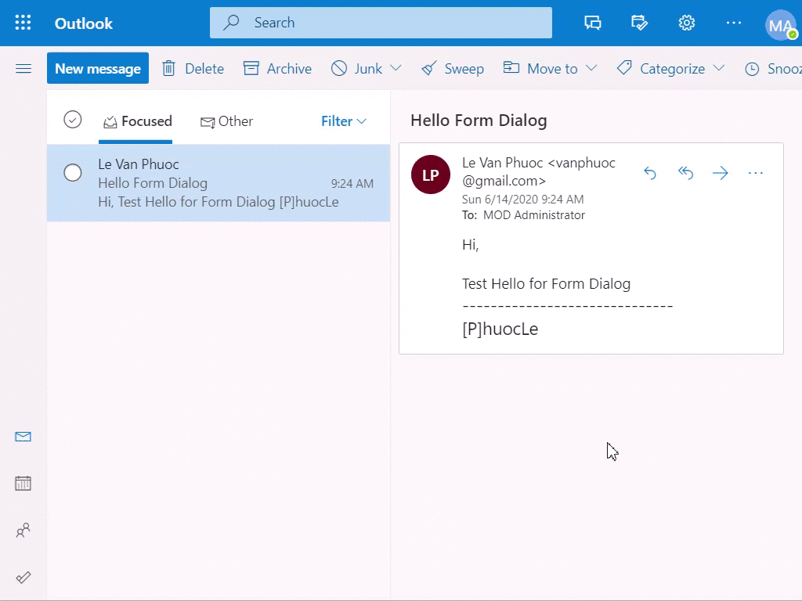

## Goal

Find User Id of User Name.


## Howto (5 steps)

### 1. Design form with **```crmdialog```**

|Action|Properties|Description
|-|-|-|
|Select [metadata](../../docs/blocks/MetaData)||<ul><li><p>**```pl_example01```** the [logical name](../../docs/others/ControlId) of form dialog, should **```unique name```** of your organization</p></li><li>**```1033```** English(United States) language code</li><li>**```1.0.0.0```** solution version</li><li>**```Example 01```** the short description of the form</li><li>**```Find User Id```** the full description of the form</li><li><p>**```example01.OnLoad```** When form load, trigger the function</p><p>*Noted:* The list empty because there are no [event](../../docs/blocks/MetaData/Event) exist on [metadata](../../docs/blocks/MetaData), you will back and update it later</p></li></ul>
|From [blocks](../../docs/blocks) drag [event](../../docs/blocks/MetaData/Event) and drop to [metadata](../../docs/blocks/MetaData)||<p><ul><li>**```OnLoad```**</li><li>**```Enabled```** yes</li><li>**```pl_/examples/example01.js```** webresource unique name</li><li>**```example01.OnLoad```** trigger function name</li><li>**```Execution Context```** yes, pass the execution context as the first parameter to trigger function</li><li>**```Parameters```** pass as the first and/or second parameter to trigger function</li></ul></p><p>*Noted:* remember select [metadata](../../docs/blocks/MetaData) to update the **```OnLoad```** property after you define this [event](../../docs/blocks/MetaData/Event)</p>
|Continue add 2 [events](../../docs/blocks/MetaData/Event) to [metadata](../../docs/blocks/MetaData)|
|From [blocks](../../docs/blocks) drag [header](../../docs/blocks/Header) and drop to [main form](../../)
|From [blocks](../../docs/blocks) drag [label](../../docs/blocks/controls/Label) and drop to [header](../../docs/blocks/Header)||<ul><li>**```pl_label_header```** the [logical name](../../docs/others/ControlId) of [label](../../docs/blocks/controls/Label) control, should **```unique name```** on your form</li><li>**```FIND USER ID```**</li><li>**```1```** the number of rows use to render [label](../../docs/blocks/controls/Label) control</li><li>**```Is Title```** yes (make font bigger)</li><li>**```Visible```** yes</li></ul>
|Continue add another [label](../../docs/blocks/controls/Label) to [header](../../docs/blocks/Header)|
|From [blocks](../../docs/blocks) drag [tab](../../docs/blocks/Tabs/Tab) and drop to [tabs](../../docs/blocks/Tabs)||<ul><li>**```tab_35f76bc6_94fa_4e2a_9877_59eef45f6134```** the [logical name](../../docs/others/ControlId) of [tab](../../docs/blocks/Tabs/Tab) control, should **```unique name```** on your form.</li><li>**```Visible```** yes</li></ul>
|[Section](../../docs/blocks/Tabs/Tab/Section) (auto created when you drop [tab](../../docs/blocks/Tabs/Tab) to [tabs](../../docs/blocks/Tabs))||<ul><li>**```section_1be6841e_eaad_4ace_bc51_974ab062d680```** the [logical name](../../docs/others/ControlId) of [section](../../docs/blocks/Tabs/Section) control, should **```unique name```** on your form.</li><li>**```Blank```** if you don't want to show the [section](../../docs/blocks/Tabs/Section) label</li><li>**```115```** the label width of [section](../../docs/blocks/Tabs/Section)</li><li>**```Left```** label alignment of [section](../../docs/blocks/Tabs/Section)</li><li>**```Left```** label position of [section](../../docs/blocks/Tabs/Section)</li><li>**```Visible```** yes</li></ul>
|From [blocks](../../docs/blocks) drag [textbox](../../docs/controls/TextBox) and drop to [section](../../docs/blocks/Tabs/Section)||<ul><li>**```pl_txt_username```** the [logical name](../../docs/others/ControlId) of [textbox](../../docs/controls/TextBox) control, should **```unique name```** on your form</li><li>**```User Name```**</li><li>**```Text```**</li><li>**```100```** max length value</li><li>**```Required```** yes</li><li>**```Disabled```** no</li><li>**```Visible```** yes</li><li>**```On Change```** blank</li><li>**```PCF```** blank</li></ul>
|Continue add another [textbox](../../docs/controls/TextBox) to [section](../../docs/blocks/Tabs/Section)|
|From [blocks](../../docs/blocks) drag [Footer](../../docs/blocks/Footer) and drop to [Main Form](../../)
|From [blocks](../../docs/blocks) drag [button](../../docs/controls/Button) and drop to [footer](../../docs/blocks/Footer)||<ul><li>**```pl_button_find```** the [logical name](../../docs/others/ControlId) of [button](../../docs/controls/Button) control, should **```unique name```** on your form</li><li>**```Find```**</li><li>**```Disabled```** no</li><li>**```Visibled```** yes</li><li>**```example01.OnFindClick```** select the existing [event](../../docs/blocks/MetaData/Event)</li></ul>
|Continue add another [button](../../docs/controls/Button) to [footer](../../docs/blocks/Footer)|

#### Final result with **```crmdialog```**


### 2. Explain **```example01.js```**

When design form, we used 3 events

- **```example01.OnLoad```**
- **```example01.OnFindClick```**
- **```example01.OnCloseClick```** help you

We need another event to open form

- **```example01.OnOpen```**

>The following code, I used **```formContext.getAttribute(...)```** and **```formContext.data.attributes.get(...)```**\
**You know why ?** Because, from the link: [Collections in the formContext object model](https://docs.microsoft.com/en-us/powerapps/developer/model-driven-apps/clientapi/clientapi-form-context#collections-in-the-formcontext-object-model) **```formContext.data.attributes```** provides access to **```non-entity bound attributes```**.

#### Full **```example01.js```** code (JS ES6 code)

```js
"use strict";
var example01 = (function () {
    "use strict";
    const EMPTY_GUID = "00000000-0000-0000-0000-000000000000";
    const position = {
        Center: 1,
        Side: 2
    }
    async function onOpen(executionContext) {
        const options = {
            position: position.Center,
            width: 530,
            height: 270
        };
        const { userName } = Xrm.Utility.getGlobalContext().userSettings;
        const params = {
            pl_in_username: userName
        };
        const result = await Xrm.Navigation.openDialog("pl_example01", options, params)
        const userId = result.parameters.pl_out_userid;
        const formContext = executionContext;
        formContext.getAttribute("pl_username").setValue(userName);
        formContext.getAttribute("pl_userid").setValue(userId);
    }
    async function onLoad(executionContext) {
        const formContext = executionContext.getFormContext();
        const userName = formContext.data.attributes.get("pl_in_username").getValue();
        formContext.data.attributes.get("pl_txt_username").setValue(userName);
    }
    async function onFindClick(executionContext) {
        const formContext = executionContext.getFormContext();
        const userName = formContext.data.attributes.get("pl_in_username").getValue();
        const fetchData = {
            fullname: userName
        };
        let fetchXml = `
<fetch version='1.0' output-format='xml-platform' mapping='logical' distinct='false'>
  <entity name='systemuser'>
    <attribute name='systemuserid'/>
    <filter type='and'>
      <condition attribute='fullname' operator='eq' value='${fetchData.fullname}'/>
    </filter>
  </entity>
</fetch>
`;
        fetchXml = "?fetchXml=" + encodeURIComponent(fetchXml);
        Xrm.Utility.showProgressIndicator("Processing ...");
        const response = await Xrm.WebApi.retrieveMultipleRecords("systemuser", fetchXml);
        Xrm.Utility.closeProgressIndicator();
        let userId = EMPTY_GUID;
        if (response.entities.length === 1) {
            const entity = response.entities[0];
            userId = entity.systemuserid;
        }
        formContext.data.attributes.get("pl_txt_userid").setValue(userId.toUpperCase());
    }
    async function onCloseClick(executionContext) {
        const formContext = executionContext.getFormContext();
        const userId = formContext.data.attributes.get("pl_txt_userid").getValue();
        formContext.data.attributes.get("pl_out_userid").setValue(userId);
        formContext.ui.close();
    }
    return {
        OnOpen: onOpen,
        OnLoad: onLoad,
        OnFindClick: onFindClick,
        OnCloseClick: onCloseClick
    };
})();
```

- **```example01.OnOpen```**
  - **```params```** object pass to form
  - **```Xrm.Navigation.openDialog(...)```** open form dialog. **```YES```** this **```unsupported```** js code
  - **```result.parameters```** object return from form
  - **```formContext.getAttribute```** use to access **```entity bound attributes```**
- **```example01.OnLoad```**
  - **```formContext.data.attributes```** use to access **```non-entity bound attributes```**
- **```example01.OnFindClick```**
  - **```Xrm.WebApi```** use to access **```WebApi```**
- **```example01.OnCloseClick```**
  - **```formContext.ui.close()```** OOB js function close form

### 3. Export solution from **```crmdialog```** then import solution to Dynamics 365 CRM/CDS

>Make sure you upload **```example01.js```** as your WebResource with **```unique name```** = **```pl_/examples/example01.js```** to your Dynamics 365 CRM/CDS, otherwise you get fail when import solution.


### 4. Fire **```example01.OnOpen```** to open the dialog form (testing only)

- On ribbon button
- Or OnLoad
- Or some where ....

### 5. Results

#### 5.1. Chrome and debugger


#### 5.2 Dynamics 365 CRM/CDS Mobile App (Samsung Galaxy Note 8)



#### 5.3 Dyanmics 365 CRM/CDS App for Outlook



# Conclusion

**This example show you howtos:**

- Pass parameter value from parent form to dialog form
- Open dialog form
- OOB Dynamics 365 CRM/CDS javascript code for bound and non-bound attributes
- Close dialog form
- Read data return from dialog form
- Don't touch any **```FormXml```** code. (But you can open the [download](../../docs/others/Download) file to check **```FormXml```** code)

## Files

- [Files](files)
