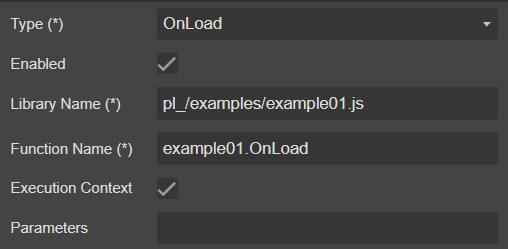

## Goal

Find User Id of User Name.


## Howto

### 1. Design with **```crmdialog```**

|Action|Properties|Description
|-|-|-|
|Select [MetaData](../../docs/blocks/MetaData) block||<ul><li><p>**```pl_example01```** dialog name</p><p>*Noted:* Dialog name should unquie name of your organization</p></li><li>**```1033```** English(United States) language code</li><li>**```1.0.0.0```** solution version</li><li>**```Example 01```** the short description of the form</li><li>**```Find User Id```** the full description of the form</li><li><p>**```example01.OnLoad```** event fire when form OnLoad.</p><p>*Noted:* you cannot select it because the [event OnLoad](../../docs/blocks/MetaData/Event) not exist on form, you will back and update it later</p></li></ul>
|From [blocks](../../docs/blocks) drag [Event](../../docs/blocks/MetaData/Event) and drop to [MetaData](../../docs/blocks/MetaData) block||<ul><li>**```OnLoad```** OnLoad event</li><li>**```Enabled```** yes</li><li>**```pl_/examples/example01.js```** WebResource name</li><li>**```example01.OnLoad```** trigger function</li><li>**```Execution Context```** yes, pass the execution context as the first parameter to trigger function</li><li>**```Parameters```** keep it blank, if not blank pass as the second parameter to trigger function</li></ul>
|Continue add [Event](../../docs/blocks/MetaData/Event) for [button Find](../../docs/blocks/controls/Button) and [button Close](../../docs/blocks/controls/Button) to [MetaData](../../docs/blocks/MetaData) block|
|From [blocks](../../docs/blocks) drag [Header](../../docs/blocks/Header) and drop to main form
|From [blocks](../../docs/blocks) drag [Label](../../docs/blocks/controls/Label) and drop to [Header](../../docs/blocks/Header) block||<ul><li>**```pl_label_header```** the [logical name](../../docs/others/ControlId) of control</li><li>**```FIND USER ID```** label render</li><li>**```1```**</li><li>**```Is Title```** yes, label render as title (font bigger)</li><li>**```Visible```** yes, show the label</li></ul>
|Continue add [Label](../../docs/blocks/controls/Label) to [Header](../../docs/blocks/Header) block||<ul><li>**```Provide your User Name and we find your User Id (GUID)```**</li></ul>

### 2. **```example01.js```**

When design form, we used 3 events

- **```example01.OnLoad```**
  - Your Dynamics 365 CRM/CDS skill here ... nothing to say
- **```example01.OnFindClick```**
  - Your Dynamics 365 CRM/CDS skill here ... nothing to say
- **```example01.OnCloseClick```** help you
  - Close form

And we need another event to open form

- **```example01.OnOpen```** help you
  - Pass paramter to form
  - Open form dialog
  - Wait the data return back

>The following code you see I used **```formContext.getAttribute(...)```** and **```formContext.data.attributes.get(...)```**\
**You know why ?** Because, from the link: [Collections in the formContext object model](https://docs.microsoft.com/en-us/powerapps/developer/model-driven-apps/clientapi/clientapi-form-context#collections-in-the-formcontext-object-model) **```formContext.data.attributes```** provides access to **non-entity bound** attributes.

#### Full **```example01.js```** code (JS ES6 code)

```js
"use strict";
var example01 = (function () {
    "use strict";
    const EMPTY_GUID = "00000000-0000-0000-0000-000000000000";
    const position = {
        Center: 1,
        Side: 2
    }
    async function onOpen(executionContext) {
        const options = {
            position: position.Center,
            width: 530,
            height: 270
        };
        const { userName } = Xrm.Utility.getGlobalContext().userSettings;
        const params = {
            pl_in_username: userName
        };
        const result = await Xrm.Navigation.openDialog("pl_example01", options, params)
        const userId = result.parameters.pl_out_userid;
        const formContext = executionContext;
        formContext.getAttribute("pl_username").setValue(userName);
        formContext.getAttribute("pl_userid").setValue(userId);
    }
    async function onLoad(executionContext) {
        const formContext = executionContext.getFormContext();
        const userName = formContext.data.attributes.get("pl_in_username").getValue();
        formContext.data.attributes.get("pl_txt_username").setValue(userName);
    }
    async function onFindClick(executionContext) {
        const formContext = executionContext.getFormContext();
        const userName = formContext.data.attributes.get("pl_in_username").getValue();
        const fetchData = {
            fullname: userName
        };
        let fetchXml = `
<fetch version='1.0' output-format='xml-platform' mapping='logical' distinct='false'>
  <entity name='systemuser'>
    <attribute name='systemuserid'/>
    <filter type='and'>
      <condition attribute='fullname' operator='eq' value='${fetchData.fullname}'/>
    </filter>
  </entity>
</fetch>
`;
        fetchXml = "?fetchXml=" + encodeURIComponent(fetchXml);
        Xrm.Utility.showProgressIndicator("Processing ...");
        const response = await Xrm.WebApi.retrieveMultipleRecords("systemuser", fetchXml);
        Xrm.Utility.closeProgressIndicator();
        let userId = EMPTY_GUID;
        if (response.entities.length === 1) {
            const entity = response.entities[0];
            userId = entity.systemuserid;
        }
        formContext.data.attributes.get("pl_txt_userid").setValue(userId.toUpperCase());
    }
    async function onCloseClick(executionContext) {
        const formContext = executionContext.getFormContext();
        const userId = formContext.data.attributes.get("pl_txt_userid").getValue();
        formContext.data.attributes.get("pl_out_userid").setValue(userId);
        formContext.ui.close();
    }
    return {
        OnOpen: onOpen,
        OnLoad: onLoad,
        OnFindClick: onFindClick,
        OnCloseClick: onCloseClick
    };
})();
```

### 3. Export solution from crmdialog then import solution to Dynamics 365 CRM/CDS

>Make sure you upload **```example01.js```** as your WebResource with **```unquie name```** = **```pl_/examples/example01.js```** to your Dynamics 365 CRM/CDS first, otherwise when solution import it failed


### 4. Fire **```example01.OnOpen```** to open the dialog (testing only)

- Fire on your ribbon button click
- Or Onload
- Or some where ....

### 5. Result and debugger


# Connclusion

This example I show you howto:

- Pass paramter value from parent form to Form Dialog
- Open Form Dialog
- OOB Dynamics 365 CRM/CDS javascript code (OnLoad, WebApi)
- Close Form Dialog
- Wait data return from Form Dialog and access it
