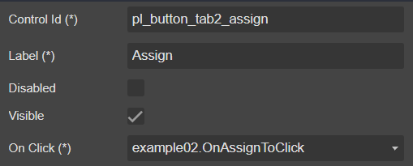
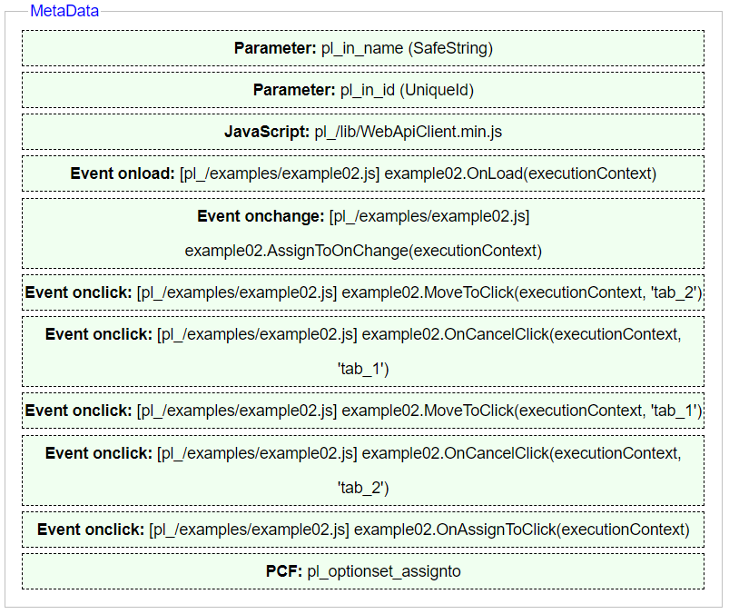

# Goal

New Assign dialog


## Howto (5 steps)

### 1. Design form with **```crmdialog```**

|Action|Properties|Description
|-|-|-|
|Select [metadata](../../docs/blocks/MetaData)|
|Add [parameter](../../docs/blocks/Parameter) to [metadata](../../docs/blocks/MetaData)|
|Continue add [parameter](../../docs/blocks/Parameter) to [metadata](../../docs/blocks/MetaData)|
|Add [javascript](../../docs/blocks/JavaScript) to [metadata](../../docs/blocks/MetaData)|
|Add [event](../../docs/blocks/Event) **```OnLoad```** to [metadata](../../docs/blocks/MetaData)|
|Continue add [event](../../docs/blocks/Event) **```OnChange```** to [metadata](../../docs/blocks/MetaData)|
|Continue add [event](../../docs/blocks/Event) **```OnClick```** for **```button Next on Tab 1```** to [metadata](../../docs/blocks/MetaData)|
|Continue add [event](../../docs/blocks/Event) **```OnClick```** for **```button Cancel on Tab 1```** to [metadata](../../docs/blocks/MetaData)|
|Continue add [event](../../docs/blocks/Event) **```OnClick```** for **```button Previous on Tab 2```** to [metadata](../../docs/blocks/MetaData)|
|Continue add [event](../../docs/blocks/Event) **```OnClick```** for **```button Cancel on Tab 2```** to [metadata](../../docs/blocks/MetaData)|
|Continue add [event](../../docs/blocks/Event) **```OnClick```** for **```button Assign on Tab 2```** to [metadata](../../docs/blocks/MetaData)|
|Add [PCF](../../docs/blocks/PCF) to [metadata](../../docs/blocks/MetaData)||[Click here](../../docs/others/PCF/OOBOptionSetControl) to get the **```XML```** properties of PCF
|Add [header](../../docs/blocks/Header) and drop to [main form](../../)
|Add [label](../../docs/blocks/Controls/Label) to [header](../../docs/blocks/Header) |
|Continue add [label](../../docs/blocks/Controls/Label) to [header](../../docs/blocks/Header)|
|Add [tab](../../docs/blocks/Tabs/Tab) to [tabs](../../docs/blocks/Tabs)|
|Add [tabheader](../../docs/blocks/Tabs/Tab/TabHeader) to [tab](../../docs/blocks/Tabs/Tab)|
|Add [label](../../docs/blocks/Controls/Label) to [tabheader](../../docs/blocks/Tabs/Tab/TabHeader)|
|Select [section](../../docs/blocks/Tabs/Tab/Section)|
|Add [tabfooter](../../docs/blocks/Tabs/Tab/TabFooter) to [tab](../../docs/blocks/Tabs/Tab)|
|Add [button](../../docs/blocks/Controls/Button) to [tabfooter](../../docs/blocks/Tabs/Tab/TabFooter)|
|Continue add [button](../../docs/blocks/Controls/Button) to [tabfooter](../../docs/blocks/Tabs/Tab/TabFooter)|
|Add second [tab](../../docs/blocks/Tabs/Tab) to [tabs](../../docs/blocks/Tabs)|
|Add [tabheader](../../docs/blocks/Tabs/Tab/TabHeader) to second [tab](../../docs/blocks/Tabs/Tab)|
|Add [label](../../docs/blocks/Controls/Label) to [tabheader](../../docs/blocks/Tabs/Tab/TabHeader)|
|Select [section](../../docs/blocks/Tabs/Tab/Section)|
|Add [lookup](../../docs/blocks/Controls/Lookup) to [section](../../docs/blocks/Tabs/Tab/Section)|
|Continue add [lookup](../../docs/blocks/Controls/Lookup) to [section](../../docs/blocks/Tabs/Tab/Section)|
|Add [tabfooter](../../docs/blocks/Tabs/Tab/TabFooter) to [tab](../../docs/blocks/Tabs/Tab)|
|Add [button](../../docs/blocks/Controls/Button) to [tabfooter](../../docs/blocks/Tabs/Tab/TabFooter)|
|Continue add [button](../../docs/blocks/Controls/Button) to [tabfooter](../../docs/blocks/Tabs/Tab/TabFooter)|
|Continue add [button](../../docs/blocks/Controls/Button) to [tabfooter](../../docs/blocks/Tabs/Tab/TabFooter)|

#### Final result with **```crmdialog```**




### Full **```example02.js```** code (JS ES6 code)

>The following code, I used **```formContext.getAttribute(...)```** and **```formContext.data.attributes.get(...)```**\
**You know why ?** Because, from the link: [Collections in the formContext object model](https://docs.microsoft.com/en-us/powerapps/developer/model-driven-apps/clientapi/clientapi-form-context#collections-in-the-formcontext-object-model) **```formContext.data.attributes```** provides access to **```non-entity bound attributes```**.

```js
"use strict";//
var example02 = (function () {
    "use strict";
    const position = {
        Center: 1,
        Side: 2
    }
    function getResource(key) {
        return Xrm.Utility.getResourceString("pl_/resources/resource", key);
    }
    function safeGuid(guid) {
        return guid.replace("{", "").replace("}", "");
    }
    function translateLanguage(executionContext) {
        const formContext = executionContext.getFormContext();
        formContext.getControl("pl_header_title").setLabel(getResource("LABEL_EX02_HEADER_TITLE"));
        formContext.getControl("pl_header_note").setLabel(getResource("LABEL_EX02_HEADER_NOTE"));
        formContext.getControl("pl_tab1_tabheader_note").setLabel(getResource("LABEL_EX02_TAB1_TABHEADER"));
        formContext.getControl("pl_optionset_assignto").setLabel(getResource("LABEL_EX02_TAB1_ASSIGN_TO"));
        formContext.getControl("pl_button_tab1_next").setLabel(getResource("BUTTON_NEXT"));
        formContext.getControl("pl_button_tab1_cancel").setLabel(getResource("BUTTON_CANCEL"));
        formContext.getControl("pl_lookup_user").setLabel(getResource("LABEL_EX02_TAB2_USER"));
        formContext.getControl("pl_lookup_team").setLabel(getResource("LABEL_EX02_TAB2_TEAM"));
        formContext.getControl("pl_button_tab2_previous").setLabel(getResource("BUTTON_PREVIOUS"));
        formContext.getControl("pl_button_tab2_cancel").setLabel(getResource("BUTTON_CANCEL"));
        formContext.getControl("pl_button_tab2_assign").setLabel(getResource("BUTTON_ASSIGN"));
    }
    async function onOpen(executionContext) {
        const options = {
            position: position.Side,
            width: 500,
            height: 300
        };
        const formContext = executionContext;
        const params = {
            pl_in_name: formContext.getAttribute("pl_name").getValue(),
            pl_in_id: formContext.data.entity.getId()
        };
        await Xrm.Navigation.openDialog("pl_example02", options, params)
    }
    async function onLoad(executionContext) {
        translateLanguage(executionContext);
        const formContext = executionContext.getFormContext();
        const name = formContext.data.attributes.get("pl_in_name").getValue();
        const controlLabelHeaderNote = formContext.ui.controls.get("pl_header_note");
        controlLabelHeaderNote.setLabel(controlLabelHeaderNote.getLabel().replace("{0}", name));
        const controlOptionSetAssignTo = formContext.getControl("pl_optionset_assignto");
        controlOptionSetAssignTo.clearOptions();
        controlOptionSetAssignTo.addOption({ text: getResource("OPTIONSET_EX02_ME"), value: 50000 });
        controlOptionSetAssignTo.addOption({ text: getResource("OPTIONSET_EX02_USER_AND_TEAM"), value: 50010 });
        formContext.data.attributes.get("pl_optionset_assignto").fireOnChange();
        formContext.data.attributes.get("pl_lookup_user").addOnChange(lookupUserOnChange);
        formContext.data.attributes.get("pl_lookup_team").addOnChange(lookupTeamOnChange);
    }
    async function lookupUserOnChange(executionContext) {
        const formContext = executionContext.getFormContext();
        const user = formContext.data.attributes.get("pl_lookup_user").getValue();
        formContext.getControl("pl_button_tab2_assign").setDisabled(user === null);
    }
    async function lookupTeamOnChange(executionContext) {
        const formContext = executionContext.getFormContext();
        const team = formContext.data.attributes.get("pl_lookup_team").getValue();
        formContext.getControl("pl_button_tab2_assign").setDisabled(team === null);
    }
    async function assignToOnChange(executionContext) {
        const formContext = executionContext.getFormContext();
        const assignTo = formContext.data.attributes.get("pl_optionset_assignto").getValue();
        const labelNote = formContext.getControl("pl_tab2_tabheader_note");
        const lookupUser = formContext.getControl("pl_lookup_user");
        const lookupTeam = formContext.getControl("pl_lookup_team");
        labelNote.setLabel(assignTo === 50000 ? getResource("LABEL_EX02_TAB2_TABHEADER_USER") : getResource("LABEL_EX02_TAB2_TABHEADER_TEAM"));
        lookupUser.setVisible(assignTo === 50000)
        formContext.data.attributes.get("pl_lookup_user").setValue(null);
        formContext.data.attributes.get("pl_lookup_user").fireOnChange();
        lookupTeam.setVisible(assignTo === 50010);
        formContext.data.attributes.get("pl_lookup_team").setValue(null);
        formContext.data.attributes.get("pl_lookup_team").fireOnChange();
    }
    async function moveToClick(executionContext, tab) {
        const formContext = executionContext.getFormContext();
        formContext.ui.moveTo(tab);
    }
    async function onCancelClick(executionContext, tab) {
        const formContext = executionContext.getFormContext();
        formContext.ui.close();
    }
    async function onAssignToClick(executionContext) {
        const formContext = executionContext.getFormContext();
        Xrm.Utility.showProgressIndicator("Processing ...");
        const id = formContext.data.attributes.get("pl_in_id").getValue();
        var request = {
            async: true,
            entityName: "pl_dialog",
            entityId: safeGuid(id),
            entity: {}
        };
        const assignTo = formContext.data.attributes.get("pl_optionset_assignto").getValue();
        if (assignTo === 50000) {
            const userId = formContext.data.attributes.get("pl_lookup_user").getValue()[0].id;
            request.entity["ownerid@odata.bind"] = `/systemusers(${safeGuid(userId)})`
        }
        else {
            const teamId = formContext.data.attributes.get("pl_lookup_team").getValue()[0].id;
            request.entity["ownerid@odata.bind"] = `/teams(${safeGuid(teamId)})`
        }
        await WebApiClient.Update(request);
        Xrm.Utility.closeProgressIndicator();
        formContext.ui.close();
    }
    return {
        OnOpen: onOpen,
        OnLoad: onLoad,
        AssignToOnChange: assignToOnChange,
        MoveToClick: moveToClick,
        OnCancelClick: onCancelClick,
        OnAssignToClick: onAssignToClick
    };
})();
```

### 3. Export solution from **```crmdialog```** then import solution to Dynamics 365 CRM/CDS

#### 3.1 Prepare files

- **```example02.js```** is **```javascript```** WebResource **```unique name```** = **```pl_/examples/example02.js```**
- **```WebApiClient.min.js```** is **```javascript```** WebResource **```unique name```** = **```pl_/lib/WebApiClient.min.js```**. You can [download WebApiClient.min.js](https://github.com/DigitalFlow/Xrm-WebApi-Client)
- **```resource.1033.resx```** is **```resource```** WebResource **```unique name```** = **```pl_/resources/resource.1033.resx```**
- **```resource.1066.resx```** is **```resource```** WebResource **```unique name```** = **```pl_/resources/resource.1066.resx```**
- Setup **```pl_/examples/example02.js```** dependencies with **```pl_/resources/resource.1033.resx```** and **```pl_/resources/resource.1066.resx```**


#### 3.2 Import solution

- ...

### 4. Fire **```example02.OnOpen```** to open the dialog form (testing only)

- ...

### 5. Results

- ...

# Conclusion

**This example show you howtos:**

- Open dialog to right side (like Quick Create)
- Use PCF control
- Event OnChange when design-time form
- Reference javascript library in desgin-time and use it
- Reference *.resx to use multiple language
- Multiple pages (like wizard) and howto navigate to page
- Use OOB javascript function (addOption, fireOnChange, addOnChange, ...)

## Files

- [Files](files)
