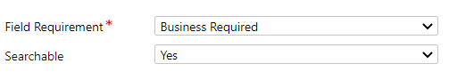

# Welcome to crmdialog

Always remmeber this is **unsupport** (until now).

## Documents

- [How to use crmdialog](docs)

## Examples

An easy to learn that doing the examples one by one that you can develop your own crmdialog

- [Find User Id](examples/example01)
- [All Textboxes](examples/example02)
